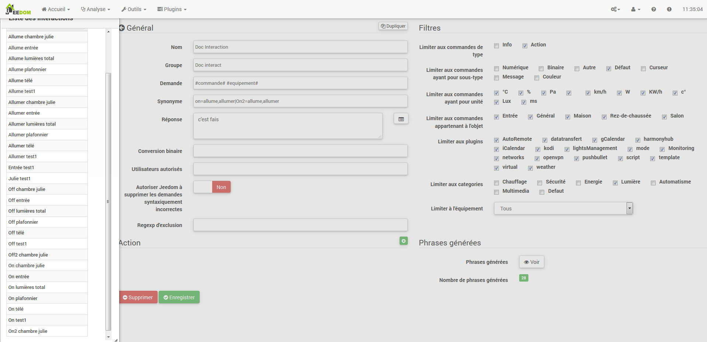
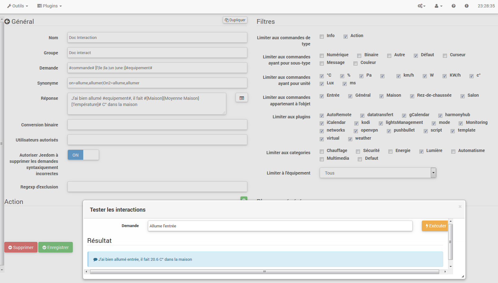
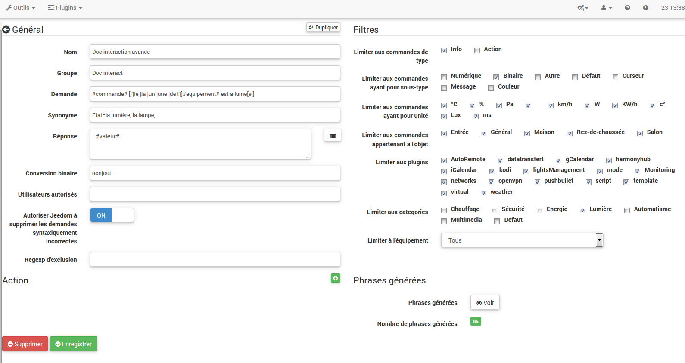
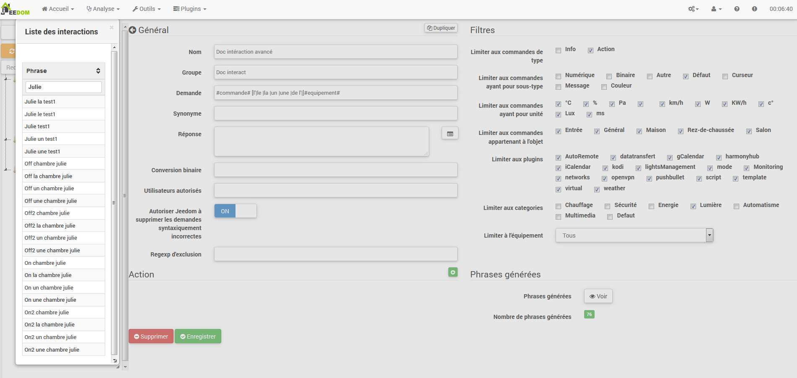
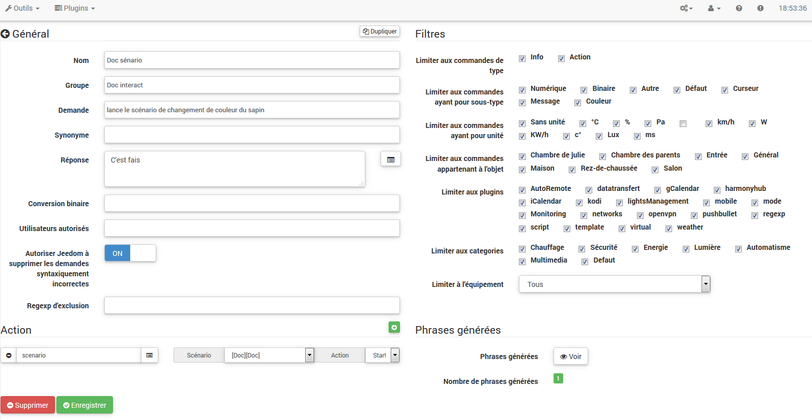

The interaction system in Jeedom allows actions to be
from text or voice commands.

These orders can be obtained by:

-   SMS: send an SMS to launch commands (action) or ask a
    question (info).

-   Chat: Telegram, Slack, etc.

-   Vocal: dictate a sentence with Siri, Google Now, SARAH, etc. For
    launch commands (action) or ask a question (info).

-   HTTP: launch an HTTP URL containing the text (eg Tasker, Slack)
    to launch commands (action) or ask a question (info).

The interest of interactions lies in the simplified integration into
other systems like smartphone, tablet, other home automation box, etc.

To access the interaction page, go to Tools →
Interactions:

At the top of the page, there are 3 buttons:

-   **Add**: which allows to create new interactions.

-   **Regenerate**: who will recreate all interactions (can be
    very long &gt; 5mn).

-   **Test**: which opens a dialog box for writing and
    test a sentence.

> **Tip**
>
> Si vous avez une interaction qui génère les phrases pour les lumières
> par exemple et que vous ajoutez un nouveau module de commande de
> lumière, il vous faudra soit régénérer toutes les interactions, soit
> aller dans l’interaction en question et la sauvegarder de nouveau pour
> créer les phrases de ce nouveau module.

Principle
========

The creation principle is quite simple, we will define a sentence
generator model that will allow Jeedom to create one or more
hundreds of other phrases that will be possible combinations of the
model.

We will define answers in the same way with a model (this allows
Jeedom to have several answers for one and the same question).

We can also define a command to execute if for example
the interaction is not linked to an action but information or if
wish to perform a particular action after this one (it is also
possible to run a scenario, to control several commands ...).

Configuration
=============

The configuration page consists of several tabs and
buttons:

-   **Phrases**: Displays the number of phrases in the interaction (one click
    above you shows them)

-   **Save**: saves the current interaction

-   **Delete**: delete the current interaction

-   **Duplicate**: Duplicate the current interaction

General
=======

-   **Name**: name of the interaction (may be empty, the name replaces the
    text of the request in the list of interactions).

-   **Group**: Interaction group, this allows to organize them
    (may be empty, so will be in the "none" group).

-   **Active**: Enable or disable the interaction.

-   **Request**: the generating model sentence (required).

-   **Synonym**: allows you to define synonyms on the names
    some orders.

-   **Answer**: the answer to provide.

-   **Binary conversion**: converts binary values ​​to
    open / closed for example (only for type orders
    binary info).

-   **Authorized Users**: limits the interaction to certain
    users (logins separated by |).

filters
=======

-   **Limit to type** commands: allows you to use only
    types actions, info or both types.

-   **Limit to commands with subtype**: limits
    generation to one or more subtypes.

-   **Limit orders with unit**: allows to limit the
    generation to one or more units (Jeedom creates the list
    automatically from the units defined in your orders).

-   **Limit to the commands belonging to the object**: allows to limit
    generation to one or more objects (Jeedom creates the list
    automatically from the objects you have created).

-   **Limit to the plugin**: allows to limit the generation to one or
    several plugins (Jeedom automatically creates the list from
    installed plugins).

-   **Limit to category**: Limit generation to one
    or more categories.

-   **Limit to Equipment**: Limit generation to one
    only equipment / module (Jeedom automatically creates the list
    from the equipment / modules you have).

Action
======

Use if you want to target one or more specific commands
or pass particular parameters.

Examples
========

> **Note**
>
> Screenshots may be different in view of developments.

Simple interaction
------------------

The easiest way to set up an interaction is with him
give a rigid generator model, without variation possible. This
method will very precisely target a command or a scenario.

In the following example, we can see in the "Request" field the sentence
exact to provide to trigger the interaction. Here, to turn on the
ceiling lamp of the living room.

We can see, on this capture, the configuration to have a
interaction linked to a specific action. This action is defined in
the "Action" part of the page.

We can very well imagine doing the same with several actions for
light several lamps in the living room as the following example:

In the two examples above, the model sentence is identical but the
resulting actions change depending on what is configured
in the "Action" part, so we can already with a simple interaction to
single sentence imagine combined actions between various commands and
various scenarios (we can also trigger scenarios in the game
interaction action).

> **Tip**
>
> To add a scenario, create a new action, write "scenario"
> without accent, press the tab key on your keyboard for
> display the scenario selector.

Multiple interaction commands
------------------------------

We will here see all the interest and all the power of
interactions, with a sentence model we will be able to generate
phrases for a whole group of commands.

We will resume what has been done above, delete the actions that
had been added, and instead of the fixed sentence, in "Request",
we will use the **\ # command \ #** and **\ # equipment \ #** tags.
Jeedom will replace these tags by the name of the commands and the name of
equipment (we can see the importance of having names of
coherent control / equipment).

We can see here that Jeedom generated 152 sentences from
our model. However, they are not very well built and
has a bit of everything.

To make order in all this, we will use the filters (part
right of our configuration page). In this example, we want
generate sentences to light lights. We can uncheck the
type of command info (if I save, I only have 95 sentences left
generated), then, in the subtypes, we can keep checked only
"default" which corresponds to the action button (only 16 remains
sentences).

It's better, but it can be even more natural. If I take
the example generated "On entry", it would be nice to be able to transform
this phrase "turns on the input" or "turn on the input". To do
this Jeedom has, under the request field, a synonymous field that goes
allow us to name the names of orders differently in our
"generated" sentences, here it is "on", I even have "on2" in modules
who can control 2 outputs.

In the synonyms, we will indicate the name of the order and the (s)
synonym (s) to use:

We can see here a syntax a little new for synonyms. A name
can have several synonyms, here "on" is synonymous
"turn on" and "turn on". The syntax is therefore "* name of the command *"
***=*** "* synonym 1 *" ***, *** "* synonym 2 *" (we can put as many
synonymous that we want). Then, to add synonyms for another
command name, just add after the last synonym a bar
vertical "* | *" after which you can again name the
command that will have synonyms like for the first part, etc.

It's already better, but it's still missing for the "on" "input" command
the "l" and for others the "la" or "le" or "un", etc. We could
change the name of the equipment to add it, that would be a solution,
otherwise we can use the variations in the request. This consists of
list a series of possible words at a location of the sentence, Jeedom
so will generate sentences with these variations.

We now have a little more correct sentences with sentences that
are not right, for our example "on" "input". so we find
"Turn on input", "Turn on an entry", "Turn on an entry", "Turn on"
the entrance "etc. So we have all possible variants with what we
added between "\ [\]" and this for each synonym, which generates
quickly a lot of sentences (here 168).

In order to refine and not to have improbable things such as
"turn on the TV", we can allow Jeedom to delete the requests
syntactically incorrect. He will delete what is too far away
of the actual syntax of a sentence. In our case we go from 168
sentences to 130 sentences.

It therefore becomes important to build well model sentences and
synonyms as well as select the right filters to not generate
too many useless sentences. Personally, I find it interesting to have
some inconsistencies of the style "an entry" because if at home, you have
a foreign person who does not speak French correctly
interactions will still work.

Customize answers
--------------------------

So far, as a response to an interaction, we had a simple
sentence that did not say much except that something
past. The idea would be that Jeedom tells us what he did a little bit more
precisely. This is where the response field in which we are going
ability to customize the return based on the command executed.

To do this, we will again use the Jeedom Tag. For our
lights we can use a phrase of the style: I turned on
\ #equipment \ # (see screenshot below).

We can also add any value from another command as
a temperature, a number of people, etc.

Binary conversion
------------------

Binary conversions apply to info commands whose
subtype is binary (returns 0 or 1 only). So you have to activate
the right filters, as we can see on the catch a little lower
(for categories we can check them all, for the example I did not
kept that light).

As can be seen here, I have kept almost the same structure
for the request (it is voluntary to focus on
specificities). Of course, I adapted the synonyms to have some
coherent thing. On the other hand, for the answer, it is **imperative** to
put only \ #value \ # that represents the 0 or 1 that Jeedom is going
replace with the following binary conversion.

The field **binary conversion** must contain 2 answers: first the
answer if the value of the command is 0, then a vertical bar "|"
of separation and finally the answer if the order is worth 1. Here the
answers are simply no and yes but we could put a sentence
a little longer.

> **Warning**
>
> Tags do not work in binary conversions.

Authorized Users
----------------------

The "Authorized Users" field allows you to allow only certain
people to execute the command, you can put multiple profiles
separating them with a "|"

Example: person1 | person2

One can imagine that an alarm can be activated or deactivated by a
child or a neighbor who would come to water the plants in your absence.

Regexp exclusion
------------------

It is possible to create
[Regexp] (https://fr.wikipedia.org/wiki/Expression_rationnelle)
exclusion, if a generated sentence matches this Regexp it will be
deleted. The interest is to be able to remove false positives, it is
to say a sentence generated by Jeedom that activates something that does not
does not correspond to what we want or who would parasitize another
interaction that would have a similar sentence.

We have 2 places to apply a Regexp:

-   in the same interaction in the "exclusion Regexp" field.

-   In the menu Administration → Configuration → Interactions → field "Regexp
    general exclusion for interactions ".

For the field "General exclusion regex for interactions", this
rule will be applied to all interactions, which will be created or
saved again later, if we want to apply it to all
existing interactions must regenerate interactions.
Generally it is used to erase sentences incorrectly
formed in most of the generated interactions.

For the "Exclusion Regexp" field in the configuration page of
each interaction, we can put a specific Regexp that will act
only on that interaction, so it allows you to delete
more precisely for an interaction. It can also allow
to clear an interaction for a specific command for which one
does not want to offer this opportunity as part of a generation of
multiple orders.

The following screenshot shows the interaction without the Regexp. In the
list on the left, I filter the sentences to show you only the
sentences that will be deleted. In reality there are 76 sentences generated
with the configuration of the interaction.

As you can see on the next screenshot, I added a
simple regexp that will fetch the word "Julie" in the generated sentences
and delete them, however we can see in the list on the left that there
always have sentences with the word "julie", in expressions
regular, Julie is not equal to Julie, we call this a
case sensitivity or in good French a capital letter is different
a tiny one. As can be seen in the following screenshot, it does not
remains more than 71 sentences, the 5 with a "Julie" have been removed.

A regular expression is composed as follows:

-   First a delimiter, here is a slash "/" placed in
    beginning and end of expression.

-   The point following the slash represents any
    character, space or number.

-   The "\ *" indicates that there may be 0 or more times
    the character that precedes it, here a point, so in good French
    any element.

-   Then Julie, which is the word to look for (word or other diagram
    of expression), followed again by a point and then a slash.

If we translate this expression into a sentence it would give "search the
word Julie that is preceded by anything and followed by any
what".

This is an extremely simple version of regular expressions but
already very complicated to understand, it took me a moment to grasp
the operation. As a more complex example, a regexp for
check a URL:

/ \ ^ (Https: \\ / \\ /)? (\ [\\ da-z \\ .- \] +) \\ (\ [az \\ \.] {2,6}) (. \ [\\ / \\ w
\\ .- \] \ *) \ * \\ /? \ $ /

Once you can write that, you understand the expressions
regular.

To solve the problem of upper and lower case, we can add to
our expression an option that will make it case-insensitive, or
in other words, who considers a lowercase letter equal to a capital letter;
to do this we just have to add at the end of our expression a
"I".

With the addition of the option "i" we see that there are only 55 left
generated sentences and in the list on the left with the filter julie for
search for phrases that contain this word, we notice that there are
Much more.

As it is an extremely complex subject, I will not go further
detail here, there are enough tutorials on the net to help you, and
do not forget that Google is your friend too because yes, it's my friend,
it was he who taught me to understand Regexp and even to code. So
if he helped me, he can also help you if you put good
will.

Useful links :

-   <Http://www.commentcamarche.net/contents/585-javascript-l-objet-regexp>

-   <Https://www.lucaswillems.com/fr/articles/25/tutoriel-pour-maitriser-les-expressions-regulieres>

-   <Https://openclassrooms.com/courses/concevez-votre-site-web-avec-php-et-mysql/les-expressions-regulieres-partie-1-2>

Comprehensive response of several informations
------------------------------------------

It is also possible to put several info commands in one
answer, for example to have a summary of the situation.

In this example we see a simple sentence that will return us a
response with 3 different temperatures, so here we can put a little
all we want in order to have a set of information in one
one time.

Is there someone in the room?
------------------------------------

### Basic version

-   So the question is "Is there anyone in the room?"

-   The answer will be "no there is no one in the room" or "yes there is
    someone in the room "

-   The command that responds to this is "\ # \ [Chamber of
    julie \] \ [GSMF-001-2 \] \ [Presence \] \ # "

This example specifically targets a specific device which allows
to have a personalized answer. We could imagine replacing
the answer of the example by "no there is no one in the room of
* julie * | yes there is someone in * julie's room *

### Evolution

-   So the question is "\ #command \ # \ [in the | in the \] \ #object \ #"

-   The answer will be "no there is no one in the room" or "yes there is
    someone in the room "

-   There is no command that responds to this in the Action action part
    that it is a multiple interaction

-   By adding a regular expression we can clean the commands
    that we do not want to see to have only the sentences on the
    "Presence" commands.

Without the Regexp we get here 11 sentences, but my interaction aims
to generate sentences only to ask if there is anyone in
a room, so I do not need lamp status or anything like the
taken, which can be solved with regexp filtering. To give back
even more flexible we can add synonyms, but in this case it
do not forget to modify the regexp.

Know the temperature / humidity / brightness
--------------------------------------------

### Basic version

We could write the sentence in hard as for example "what is the
room temperature ", but it would be necessary to make one for each sensor
temperature, brightness and humidity. With the generation system
Jeedom phrase, so we can with one interaction generate the
sentences for all sensors of these 3 types of measurement.

Here a generic example that serves to know the temperature,
the humidity, the brightness of the different pieces (object in the Jeedom sense).

-   So we can see that a generic phrase like "What is the
    living room temperature "or" What is the brightness of the room "
    can be converted to: "what is \ [la | l \\ \ \ \ object \ object \"
    (the use of \ [mot1 | mot2 \] allows to say this possibility
    or that one to generate all possible variations of the sentence
    with word1 or word2). When generating Jeedom will generate all
    the possible combinations of sentences with all the commands
    existing (depending on the filters) by replacing \ #command \ # with
    the name of the command and \ #object \ # by the name of the object.

-   The answer will be type "21 ° C" or "200 lux" just put:
    \ #value \ # \ #unite \ # (the unit is to be completed in the configuration
    of each order for which we want to have one)

-   This example therefore generates a sentence for all the commands of
    digital info type that have a unit, so we can uncheck
    units in the right filter limited to the type of interest.

### Evolution

So we can add synonyms to the command name to have some
something more natural, add a regexp to filter the commands that
have nothing to do with our interaction.

Added synonym, lets Jeedom say that a command called
"X" can also be called "Y" and so in our sentence if we have "lit
y ", Jeedom knows it's turning on x. This method is very handy
to rename command names that when they are displayed to
the screen are written in a way that is not natural vocally or
in a sentence written as "ON", a button written like this is
totally logical but not in the context of a sentence.

You can also add a Regexp filter to remove some commands.
Using the simple example we see "battery" phrases or
"latency", which have nothing to do with our interaction
temperature / humidity / brightness.

We can see a regexp:

**(battery | latency | pressure | speed | consumption)**

This allows you to delete all orders that have one of these
words in their sentence

> **Note**
>
> The regexp here is a simplified version for simple use.
> We can either use traditional expressions or
> use the simplified expressions as in this example.

Pilot a dimmer or a thermostat (slider)
-------------------------------------------

### Basic version

It is possible to control a lamp in percentage (dimmer) or a
thermostat with the interactions. Here is an example to pilot his
dimmer on a lamp with interactions:

As we see, there is here in the application the tag **\ # setpoint \ #** (on
can put what we want) which is included in the order of the
drive to apply the desired value. To do this, we have 3 parts
: \ * Request: in which we create a tag that will represent the value
which will be sent to the interaction. \ * Answer: we reuse the tag for
the answer to be sure that Jeedom correctly understood the request.
\ * Action: we put an action on the lamp that we want to control and in
the value is passed to us our tag * deposit *.

> **Note**
>
> Any tag can be used except those already used by
> Jeedom, there may be several to control for example
> several orders. Also note that all tags are passed to
> scenarios initiated by the interaction (however, the scenario
> or "Run in the foreground").

### Evolution

You may want to control all cursor type commands with a
only interaction. With the following example we will be able to order
multiple drives with a single interaction and thus generate a
set of sentences to control them.

In this interaction, we have no command in the action part, we
lets Jeedom generate from the tags the list of sentences, we can
see the **\ # slider \ #** tag. It is imperative to use this tag for
setpoints in a multiple interaction commands it may not be
the last word of the sentence. We can also see in the example that we
can use in the response a tag that is not part of the
request, the majority of the tags available in the scenarios are
also available in interactions and so can be used
in an answer.

Result of the interaction:

We can see that the tag **\ # equipment \ #** which is not used
in the application is well completed in the answer.

Driving the color of an LED headband
--------------------------------------

It is possible to control a color control by the interactions in
for example, asking Jeedom to light a led strip in blue.
Here is the interaction to do:

Until then nothing complicated, it must be configured
the colors in Jeedom for it to work; go to the
menu → Configuration (top right) then in the game
"Configuration of interactions":

As can be seen on the catch, there is no color
configured, so add colors with the "+" on the right. The
name of the color, that's the name you'll go to the interaction,
then in the right part ("HTML Code" column), clicking on the
black color we can choose a new color.

We can add as many as we like, we can put as name
any one, so we could imagine assigning a color for
the name of each family member.

Once configured, you say "Turn on the tree in green", Jeedom goes
search the application for a color and apply it to the order.

Use coupled with a scenario
---------------------------------

### Basic version

It is possible to couple an interaction to a scenario in order to
perform actions a little more complex than performing a simple
action or request for information.

This example allows to launch the scenario which is linked in the
part action, we can of course have several.

Programming an action with interactions
------------------------------------------------

Interactions can do a lot of things in particular.
You can dynamically program an action. Example: "Turn on
heating for 22 to 14:50. "For that nothing more simple, it is enough
to use the tags \ #time \ # (if we define a precise time) or
\ #duration \ # (for in X time, example in 1 hour):

> **Note**
>
> You will notice in the answer the tag \ #value \ # it contains
> in the case of a programmed interaction the programming time
> effective
